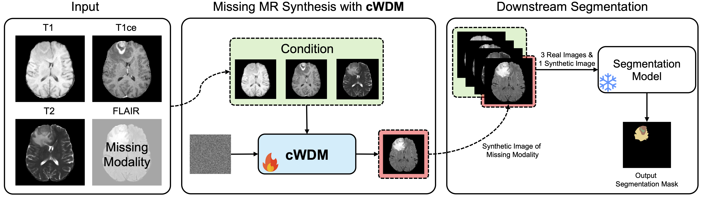

# cWDM: Conditional Wavelet Diffusion Models for Cross-Modality 3D Medical Image Synthesis

:construction: :pick: :hammer_and_wrench: :construction_worker:

The code for cWDM will soon be released on this repository! Stay tuned!

    

    

