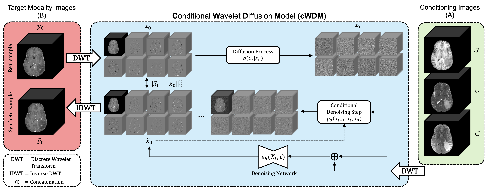

# cWDM: Conditional Wavelet Diffusion Models for Cross-Modality 3D Medical Image Synthesis
[](https://opensource.org/licenses/MIT)
[](https://arxiv.org/abs/2411.17203)

This is the official PyTorch implementation of the paper **cWDM: Conditional Wavelet Diffusion Models for Cross-Modality 3D Medical Image Synthesis** by [Paul Friedrich](https://pfriedri.github.io/), Alicia Durrer, Julia Wolleb and Philippe C. Cattin.


If you find our work useful, please consider to :star: **star this repository** and :memo: **cite our paper**:
```bibtex
@article{friedrich2024cwdm,
         title={cWDM: Conditional Wavelet Diffusion Models for Cross-Modality 3D Medical Image Synthesis},
         author={Paul Friedrich and Alicia Durrer and Julia Wolleb and Philippe C. Cattin},
         year={2024},
         journal={arXiv preprint arXiv:2411.17203}}
```

## Paper Abstract
This paper contributes to the "BraTS 2024 Brain MR Image Synthesis Challenge" and presents a conditional Wavelet Diffusion Model (cWDM) for directly solving a paired image-to-image translation task on high-resolution volumes. While deep learning-based brain tumor segmentation models have demonstrated clear clinical utility, they typically require MR scans from various modalities (T1, T1ce, T2, FLAIR) as input. However, due to time constraints or imaging artifacts, some of these modalities may be missing, hindering the application of well-performing segmentation algorithms in clinical routine.
To address this issue, we propose a method that synthesizes one missing modality image conditioned on three available images, enabling the application of downstream segmentation models. We treat this paired image-to-image translation task as a conditional generation problem and solve it by combining a Wavelet Diffusion Model for high-resolution 3D image synthesis with a simple conditioning strategy. This approach allows us to directly apply our model to full-resolution volumes, avoiding artifacts caused by slice- or patch-wise data processing. While this work focuses on a specific application, the presented method can be applied to all kinds of paired image-to-image translation problems, such as CT-MR and MR-PET translation, or mask-conditioned anatomically guided image generation.

<p>
    
</p>


## Dependencies
We recommend using a [conda](https://github.com/conda-forge/miniforge#mambaforge) environment to install the required dependencies.
You can create and activate such an environment called `cwdm` by running the following commands:
```sh
mamba env create -f environment.yml
mamba activate cwdm
```

## Training & Sampling
For training a new model or sampling from an already trained one, you can simply adapt and use the script `run.sh`. All relevant hyperparameters for reproducing our results are automatically set when using the correct `MODEL` in the general settings.
For executing the script, simply use the following command:
```sh
bash run.sh
```
**Supported settings** (set in `run.sh` file):

MODE: `'training'` (for training a model), `'sampling'` (to sample from a model), `'auto'` (missing modality detection and synthesis)

CONTR: `'t1n'`, `'t1c'`, `'t2w'`, `'t2f'`

**The script can easily be adapted for other conditional generation tasks like MR-CT and MR-PET translation, as well as mask-conditioned anatomically guided image generation.**

## Pre-trained model weights
We release pre-trained model weights on [HuggingFace](https://huggingface.co/pfriedri/cwdm).

Simply download the weights and replace the path to the model weights in the `sample_auto.py` script.

## Data
The provided code works for the following data structure (you might need to adapt the `DATA_DIR` variable in `run.sh`):
```
data
└───BRATS
    └───training
        └───BraTS-GLI-00000-000
            └───BraTS-GLI-00000-000-seg.nii.gz
            └───BraTS-GLI-00000-000-t1c.nii.gz
            └───BraTS-GLI-00000-000-t1n.nii.gz
            └───BraTS-GLI-00000-000-t2f.nii.gz
            └───BraTS-GLI-00000-000-t2w.nii.gz  
        └───BraTS-GLI-00002-000
        ...

    └───validation
        └───BraTS-GLI-00001-000
            └───BraTS-GLI-00001-000-t1c.nii.gz
            └───BraTS-GLI-00001-000-t1n.nii.gz
            └───BraTS-GLI-00001-000-t2f.nii.gz
            └───BraTS-GLI-00001-000-t2w.nii.gz  
        └───BraTS-GLI-00001-001
        ...       
```

We additionally provide a script `dropout_modality.py` to randomly drop one modality and create a pseudo-validation dataset.

## Acknowledgements
Our code is based on / inspired by the following repositories:
* https://github.com/pfriedri/wdm-3d (published under [MIT License](https://github.com/pfriedri/wdm-3d/blob/main/LICENSE))
